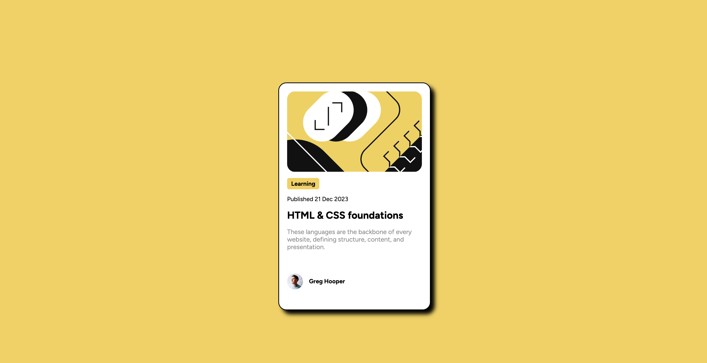
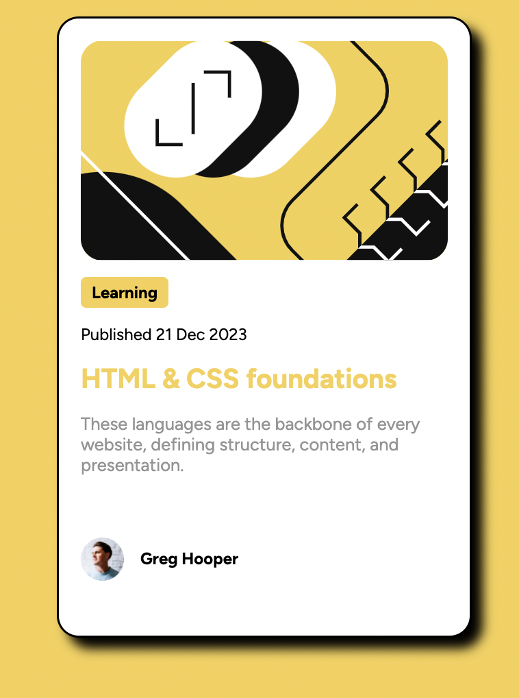

# Frontend Mentor - Blog preview card solution

This is a solution to the [Blog preview card challenge on Frontend Mentor](https://www.frontendmentor.io/challenges/blog-preview-card-ckPaj01IcS). Frontend Mentor challenges help you improve your coding skills by building realistic projects.

## Table of contents

- [Overview](#overview)
  - [The challenge](#the-challenge)
  - [Screenshot](#screenshot)
- [My process](#my-process)
  - [Built with](#built-with)
  - [What I learned](#what-i-learned)
- [Author](#author)

## Overview

### The challenge

Users should be able to:

- See hover and focus states for all interactive elements on the page

### Screenshot

On hover:
 

## My process

1. Added content in HTML file
2. Started from top to bottom added css editing html when needed.
3. Edited width/height to make it mobile responsive.
4. Added final requirement of adding hover and pointer.

### Built with

- HTML5 markup
- Flexbox

### What I learned

- Border-radius as a % created jagged edges on the elipse, use px or rem instead

- Used max-content to create colored box around text

- Used min and max width/height to make mobile responsive

- Reminded on how to import google fonts

## Author

- Github - [Marisa Duncan](https://github.com/MarisaDuncan)
- Frontend Mentor - [@MarisaDuncan](https://www.frontendmentor.io/profile/MarisaDuncan)
